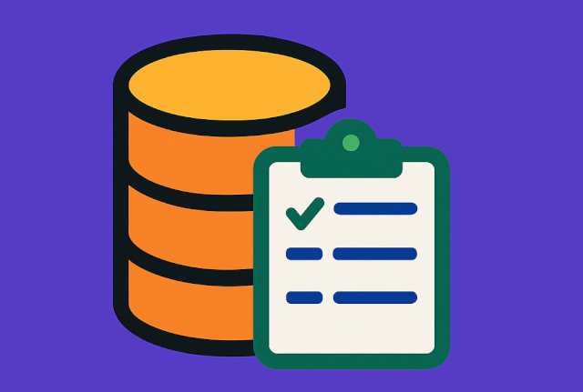

>
> ॐᳬ᳞ भूर्भुवः स्वः
>
> तत्स॑वि॒तुर्वरे॑ण्यं॒
>
> भर्गो॑ दे॒वस्य॑ धीमहि।
>
> धियो॒ यो नः॑ प्रचो॒दया॑त्॥
>

# बी.वी.एल - बोसजी के द्वारा रचित भंडार लेखांकन हेतु तन्त्राक्ष्।

> एक सुगम एवं उपयोगी भंडार संचालन हेतु तन्त्राक्ष्।

***एक रचनात्मक भारतीय उत्पाद ।***

<p align="center">
  
</p>

## `bvl` - Boseji's Inventory Management Program

[](LICENSE.txt)

Easy to use and useful stock, goods and materials handling software designed in `Golang` and a prototype in _Python_.

Simple GPLv2 CLI tool to manage inventory with `SQLite`, `CSV` import/export and logging.

---

## Features

- Command Line Interface for operating the tool.
- Support for CSV import and export
- Easy to use interface to list, add, edit and delete items from inventory.
- Multi-platform and easy migration.

## Database Schema

| Field       | Type    | Notes                                    |
| ----------- | ------- | ---------------------------------------- |
| id          | INTEGER | Primary key, starts at 1001              |
| description | TEXT    | Long description of item                 |
| location    | TEXT    | Location of the item                     |
| status      | TEXT    | Current status (Available, In Use, etc.) |
| remarks     | TEXT    | Remarks or logging field                 |

Easy way to create the SQLite database:

```sh
sqlite3 inventory.db < migrations/migration.sql
```

Index `id` field value Reset/Initialization:

```sql
-- Initialize AUTOINCREMENT sequence to start at 1001
DELETE FROM sqlite_sequence WHERE name = 'inventory';
INSERT INTO sqlite_sequence (name, seq) VALUES ('inventory', 1000);
```

This count `1000` starts the first entry from `1001`.
The same can be varied to generate a different initial value.

---

## License

This project is released under the GNU General Public License v2. See the [LICENSE](./LICENSE.txt) file for details.

Sources: <https://github.com/boseji/bvl>

`bvl` - Boseji's Inventory Management Program

Copyright (C) 2025 by Abhijit Bose (aka. Boseji)

This program is free software: you can redistribute it and/or modify
it under the terms of the GNU General Public License version 2 only
as published by the Free Software Foundation.

This program is distributed in the hope that it will be useful,
but WITHOUT ANY WARRANTY; without even the implied warranty of
MERCHANTABILITY or FITNESS FOR A PARTICULAR PURPOSE.

You should have received a copy of the GNU General Public License
along with this program. If not, see <https://www.gnu.org/licenses/>.

SPDX-License-Identifier: `GPL-2.0-only`

Full Name: `GNU General Public License v2.0 only`

Please visit <https://spdx.org/licenses/GPL-2.0-only.html> for details.

---

## Changelog

See [CHANGELOG.md](CHANGELOG.md).

---

## How to Contribute

See [CONTRIBUTING.md](CONTRIBUTING.md).

---

## Code of Conduct

See [CODE_OF_CONDUCT.md](CODE_OF_CONDUCT.md).

---
